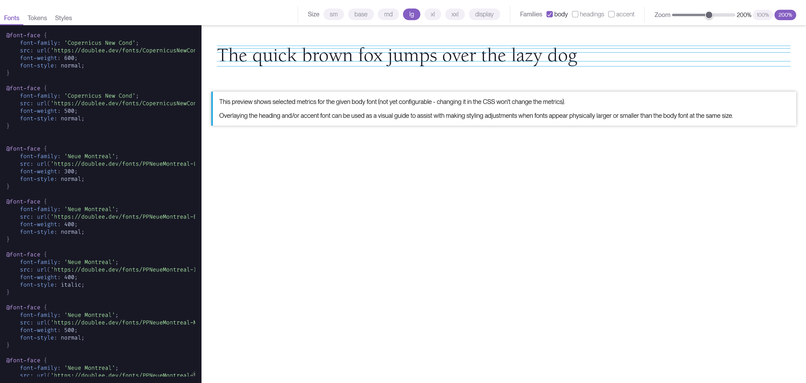

# Font combination tester

A small React app developed to help me with typography for my personal projects by comparing fonts at different sizes and providing a rudimentary CSS editor to adjust "heading" and "accent" fonts relative to a "body" font. Pulls the fonts and CSS from my [Site Style](https://github.com/doubleedesign/doublee-site-style) repository, but could be adjusted and extended for further use cases.

With thanks to the developers of [LibFont](https://github.com/Pomax/lib-font), which is used to provide the metrics of the body font.

